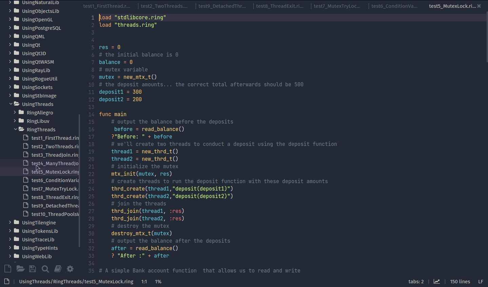
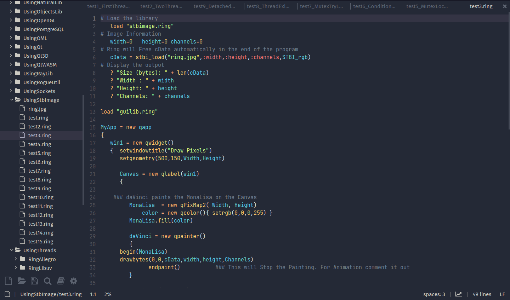

# [Ring](https://ring-lang.net/) Syntax Highlighting for Lite XL
This plugin provides syntax highlighting support for the [Ring](https://ring-lang.net/) programming language in the Lite XL text editor.

## Installation

### Using LiteXL Plugin Manager ([lpm](https://github.com/lite-xl/lite-xl-plugin-manager))
1. Open Lite XL
2. Access the Plugin Manager
3. Search for `language_ring`
4. Right-click and select "Install"

### Manual Installation
1. Clone this repository
2. Copy the `language_ring.lua` file to your Lite XL user plugin directory
   -  Linux : `~/.config/lite-xl/plugins/`
   -  Windows : `C:\Program Files\Lite XL\data\plugins`

## Screenshots

## Contributing
Contributions are welcome! Please submit issues or pull requests to the repository.

## License
This project is open-source and available under the MIT License. See the [LICENSE](https://github.com/ysdragon/ring-litexl/blob/main/LICENSE) file for more details.